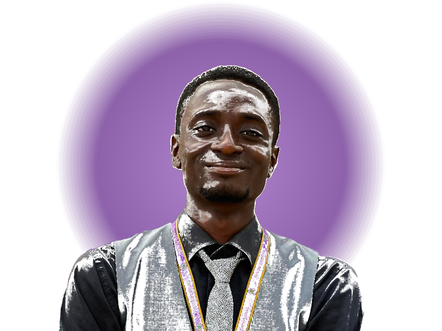

# Bolade Olalekan - Personal Portfolio

A sleek, modern, and high-performance personal portfolio built to showcase a multi-disciplinary skill set spanning Web Development, Mobile App Development, and Graphic Design. 

The website features a clean, minimal, modernist aesthetic with a dark theme, high-contrast typography, and smooth micro-interactions.

 <!-- Update with a full screenshot of the site later if needed -->

## 🚀 Features

- **Modern Tech Stack**: Built with [Next.js 15](https://nextjs.org/) (App Router), React, and TypeScript.
- **Premium Design**: Dark mode by default, vibrant neon-green accents, glassmorphism effects, and custom CSS grid animations.
- **Responsive Layout**: Fluid typography and spacing that adapts perfectly from mobile devices to ultra-wide desktop monitors.
- **Dynamic Routing**: Dedicated dynamically generated case study pages for deep-diving into individual projects.
- **Performance Optimized**: Uses Next.js `next/image` for automatic image optimization, local font loading with Geist, and server/client component splitting.

## 🛠️ Technologies Used

### Frontend
- **Framework**: Next.js (App Router)
- **Library**: React
- **Language**: TypeScript
- **Styling**: Tailwind CSS & Vanilla CSS modules
- **Typography**: Geist Sans & Geist Mono (Vercel)

### Architecture
- Custom Hooks for scroll animations (`useScrollAnimation`)
- CSS Variables for strict design system token management
- React Context for lightweight state management (e.g., ThemeProvider)

## 📂 Project Structure

```text
├── public/                 # Static assets (images, icons)
├── src/
│   ├── app/                # Next.js App Router pages and layouts
│   │   ├── about/          # About page
│   │   ├── contact/        # Contact form page
│   │   ├── portfolio/      # Project gallery and dynamic [slug] routes
│   │   ├── services/       # Services breakdown
│   │   ├── globals.css     # Global design tokens and utilities
│   │   └── page.tsx        # Homepage
│   ├── components/         # Reusable UI components
│   │   ├── sections/       # Distinct page sections (Hero, Skills, etc.)
│   │   ├── Header.tsx      # Global Navigation
│   │   └── Footer.tsx      # Global Footer
│   └── lib/                # Utilities, hooks, and static data
│       ├── data.ts         # Portfolio content (projects, skills, services)
│       └── hooks.ts        # Custom React hooks
└── next.config.ts          # Next.js configuration
```

## 💻 Getting Started

To run this project locally:

1. **Clone the repository:**
   ```bash
   git clone https://github.com/BoladeOlalekan/BoladeOlalekan-Portfolio.git
   cd BoladeOlalekan-Portfolio
   ```

2. **Install dependencies:**
   ```bash
   npm install
   ```

3. **Run the development server:**
   ```bash
   npm run dev
   ```

4. **Open the browser:**
   Navigate to [http://localhost:3000](http://localhost:3000) to view the application.

## 🎨 Design System

The styling approach avoids heavy UI libraries in favor of a bespoke, scalable CSS design system managed in `globals.css`. 

- **Color Palette**: Deep charcoal backgrounds (`#0a0a0a`), vibrant neon green accents (`#39FF14`), and subtle tertiary borders for depth.
- **Animations**: Custom `@keyframes` (pulse-glow, float, spin, fadeInUp) paired with `IntersectionObserver` via custom hooks.

## 📝 License

This project is created for personal portfolio use by Bolade Olalekan. All rights reserved.
